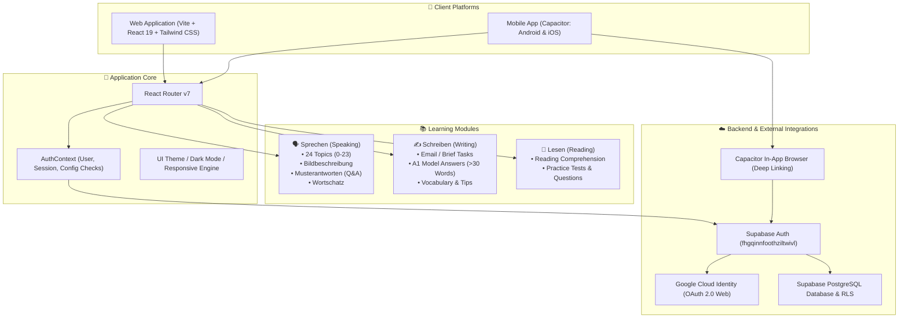
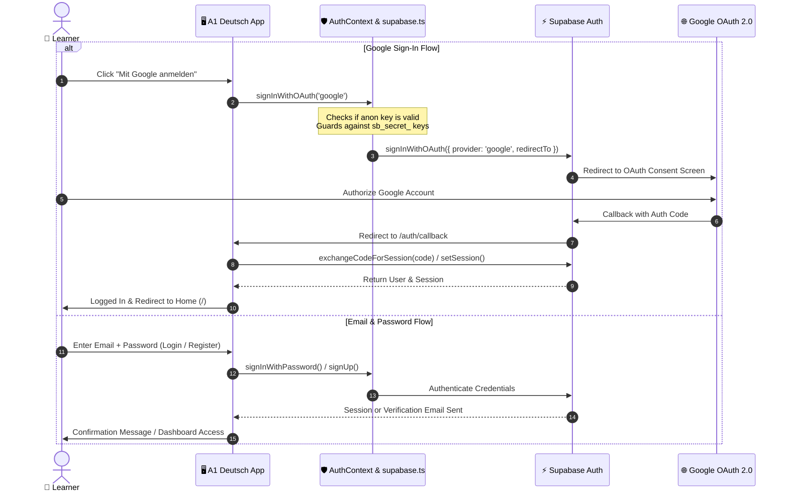
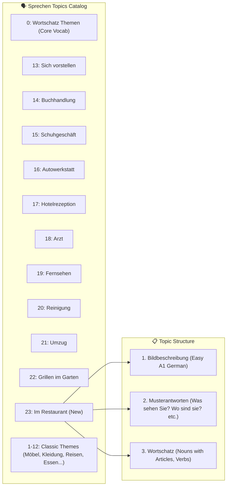
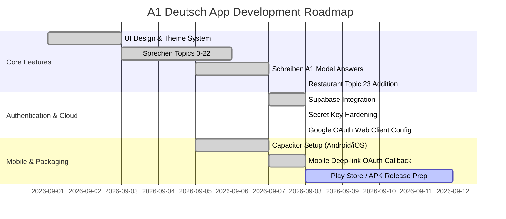

# 🇩🇪 A1 Deutsch Vorbereitung — Progress & Architecture Documentation

Comprehensive overview of the architecture, authentication workflows, study modules, and development progress for the **ÖSD / Goethe A1 Deutsch Prüfungsvorbereitung** web and mobile application.

---

## 📊 System Architecture & Component Graph

---

## 🔐 Authentication Architecture & Flow (Web & Mobile)

---

## 🗂️ Sprechen Module (Speaking Topics 0 – 23)

### Newest Added Topic: `23 - Im Restaurant — At the Restaurant`
- **Asset**: `topic23_restaurant.jpg`
- **Musterantwort**:
  - *Was sehen Sie?* 👉 Auf dem Bild sehe ich eine Kellnerin, zwei Gäste, eine Speisekarte, zwei Teller Salat und zwei Gläser Bier.
  - *Wie viele Personen sehen Sie?* 👉 Ich sehe drei Personen.
  - *Wo sind diese Personen?* 👉 Sie sind im Restaurant.
  - *Was machen diese Personen?* 👉 Ich glaube, die Gäste möchten etwas zu essen bestellen.
- **Wortschatz**: *das Restaurant, die Kellnerin, der Kellner, der Gast, die Speisekarte, der Salat, das Glas Bier, bestellen, bezahlen*.

---

## ✍️ Schreiben Module (Letter & Email Writing)

All model answers are tailored strictly for **ÖSD / Goethe A1**:
- **Grammar & Tone**: Direct, standard A1 phrasing, no complex subordinate clauses.
- **Length Constraint**: Strictly formulated with **≥ 30 words** to meet examination requirements while remaining easy to memorize.
- **Standard Layout**:
  - Salutation (*Liebe Anna,* / *Lieber Michael,*)
  - Body addressing all exam points with simple connectors (*und*, *oder*, *weil* when basic)
  - Closing (*Liebe Grüße,* / *Herzliche Grüße,*) + Name

---

## 🛠️ Key Bugfixes & Hardening Implemented

| Issue | Root Cause | Solution |
|---|---|---|
| `Forbidden use of secret API key in browser` | `sb_secret_...` was pasted into `.env` instead of `anon` key | Switched to valid Supabase JWT `anon` key; added safety guards in `src/lib/supabase.ts` |
| Google OAuth `redirect_uri_mismatch` (Error 400) | OAuth client configured as "Desktop app" with `http://localhost` | Created Web Application client with `https://fhgqinnfoothziltwivl.supabase.co/auth/v1/callback` |
| Safe Key Fallback & Developer DX | Fatal crash if secret key is present in client bundle | Added `isSecretKeyConfigured` detection and helpful warning banner in `LoginPage` and `SignupPage` |

---

## 📈 Milestones & Roadmap

